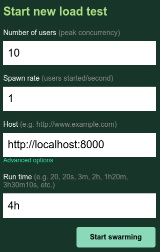

# URL shortner application

## Description
Taken the idea from [System Design Primer](https://github.com/donnemartin/system-design-primer/blob/master/solutions/system_design/pastebin/README.md), I have implemented a URL shortner application using FastAPI.

# State assumptions
- 10 million users (~4 per second)
- 10 million paste writes per month (~4 per second)
- 100 million paste reads per month (~40 per second)
- 10:1 read to write ratio

# Build and run
- ```docker build -t url-shortener .```
- ```docker run --rm -p 8000:8000 --cpus="2" -m="1024m" url-shortener```
- ```./locust-up.sh```

# Screenshots
- [Locust](https://locust.io/) setup
- 10 users hitting the application per second
- 4 hours of test duration
<p align="center">
  
</p>
<p align="center">
  
</p>
